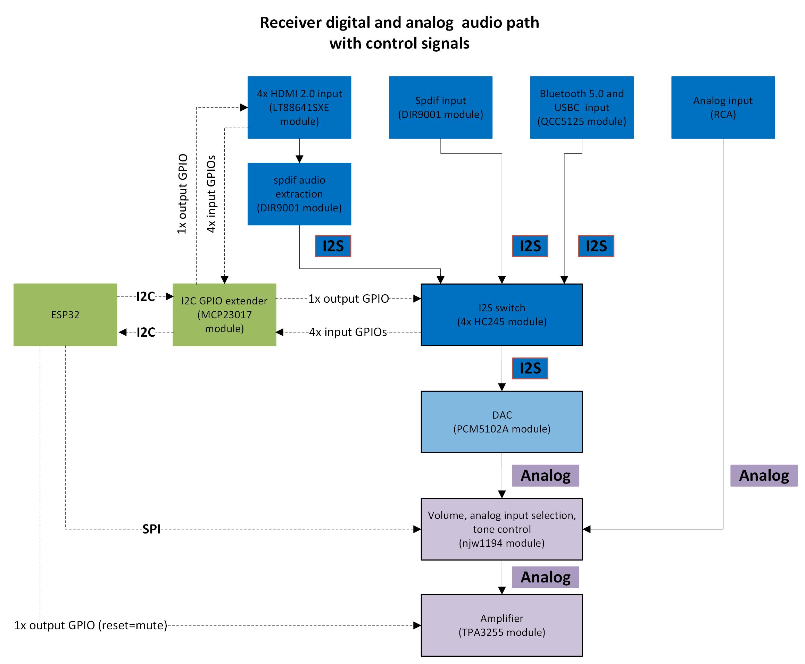
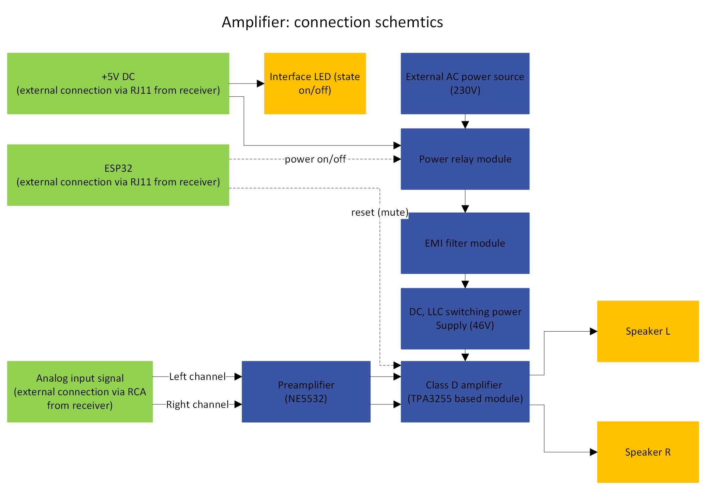
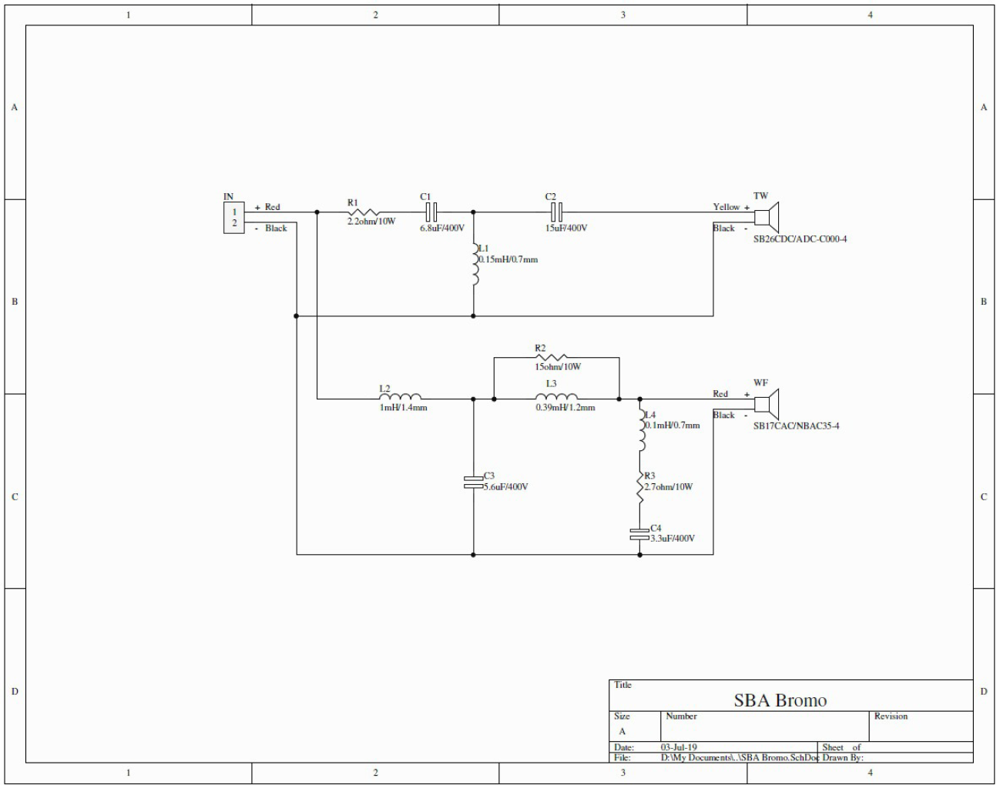
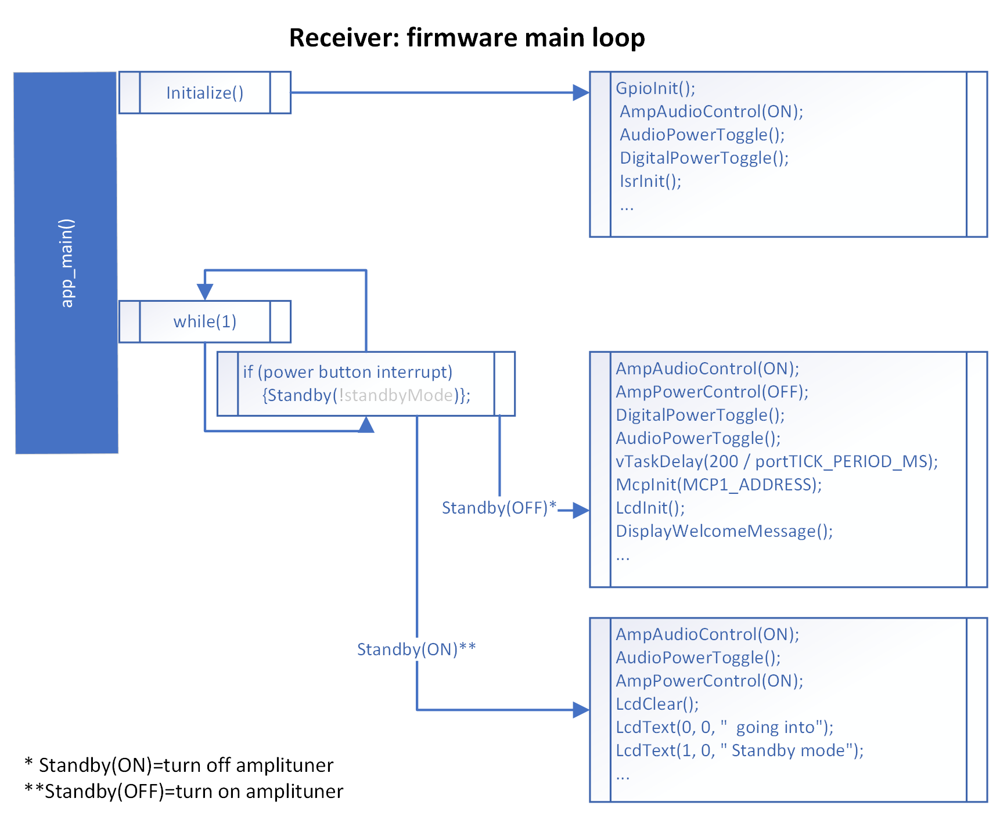

# Modular Amplituner


## Overview

**Project Short Title:** Audio Path Control Using I2C and SPI Protocols</br>
**Project Full Title:** Audio path (I2S and analog bus) control using I2C and SPI protocols on the example of a modular audio-video system consisting of a receiver (tuner), an amplifier and a speaker system

**Abstract:** This project aims to create a modular audio/video system consisting of an audio/video receiver, audio amplifier, and stereo speaker system using commercially available components. The system uses universal I2C and SPI protocols for control and the I2S and analog bus for audio data transmission. Its modular design allows for both hardware and software upgrades, catering to advanced users and audio hobbyists.

**Introduction:**  The market for consumer devices for managing audio and video transmission is dominated by commercial solutions with a top-down imposed way of controlling and processing audio-visual data and no possibility of interference from the advanced user in the hardware part of the device as well as the software part. In addition, these systems are characterized by a lack of modularity, which consequently leaves the user without the possibility of a PC-like hardware upgrade. The goal of this project is to create a modular audio/video system consisting of an audio/video receiver, audio amplifier and stereo speaker system with software for home use, based on commercially available components. The system is planned to use universal I2C and SPI protocols to control individual modules and audio path (the I2S and analog bus). One of the system's most distinctive features is its modularity. This refers to the ability to make changes to the system, both in its individual components and in the software, according to the individual audio needs of the advanced user (audio hobbyist) over the course of the system's use.

## Features

### Speaker System
- **Sound Intensity:** Up to 100dB (SPL)
- **Sensitivity:** At least 84dB
- **Frequency Range:** 50-20000Hz
- **Impedance Range:** 4-8 Ohms

### Audio Amplifier
- **Power Rating:** Minimum 150 watts
- **Type:** Class D stereo amplifier
- **Inputs:** 2x RCA audio inputs
- **Outputs:** 2x speaker outputs

### Audio Receiver
- **Digital Audio Sources:** At least one wired, one wireless
- **Analog Audio Sources:** At least one
- **Audio-Video Sources:** Four digital inputs
- **Outputs:** One digital audio-video, one analog audio
- **Control:** Volume, sound source, bass, treble, balance
- **Display:** LCD for current status and volume
- **Remote Control:** Infrared with Chromecast integration

## Assembled System - [presentations and photos](assembled_system/readme.md)

## System Architecture

### Schematics

#### Receiver - [full description](receiver/readme.md)


#### Amplifier - [full description](amplifier/readme.md)


#### Speakers - [full description](speakers/readme.md) - based on Open Source [Bromo Project](https://sbacoustics.com/product/bromo/)

   
#### Firmware - [full description and code](main/readme.md)



## Technical Specifications

### Functional Requirements
1. **Speaker System:**
   - Sound intensity: Up to 100dB (SPL)
   - Sensitivity: At least 84dB
   - Frequency range: 50-20000Hz
   - Impedance: 4-8 Ohms

2. **Audio Amplifier:**
   - Minimum power rating: 150 watts

3. **Audio Receiver:**
   - Support for various audio sources
   - Volume and functionality control
   - Display of current status
   - Control via knobs and remote

### Non-Functional Requirements
1. **Speaker Set:**
   - Two speaker columns (monitors, bass-reflex type)
   - Rated power: Up to 150W
   - Frequency range: 45-24000Hz

2. **Audio Amplifier:**
   - Stereo, class D
   - Rated power: Up to 150W/channel at THD+N < 0.01%
   - Switching power supply with EMI filter

3. **Receiver (Tuner):**
   - HDMI and Spdif inputs
   - Bluetooth 5.0 module
   - USB-C audio input
   - RCA analog audio inputs and outputs
   - Control unit: microcontroller (SoC)
   - DAC, LCD display, control encoders

## Installation

1. Clone the repository:
   ```bash
   git clone https://github.com/dabigatran/modular-amplituner.git