# Amplifier Schematics

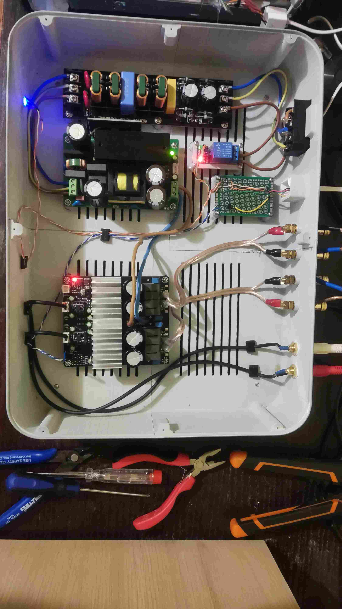
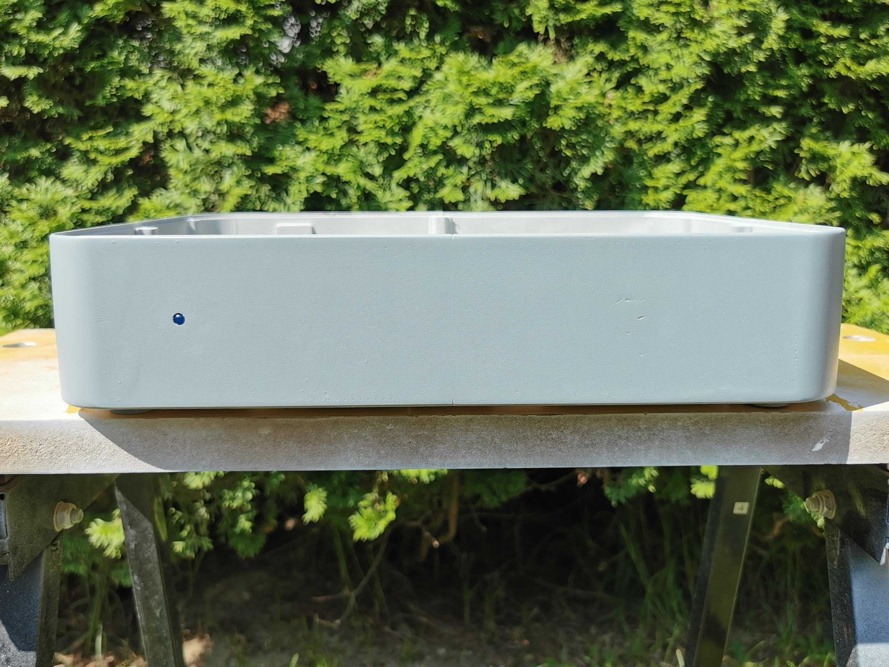
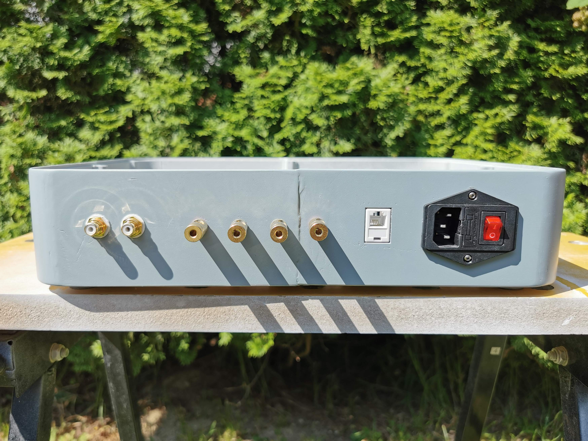

# Amplifier Components

## Power Supply
- **Dual LLC 500W, 46V Switching Power Supply Module**
  - Lusya C1-009
  - 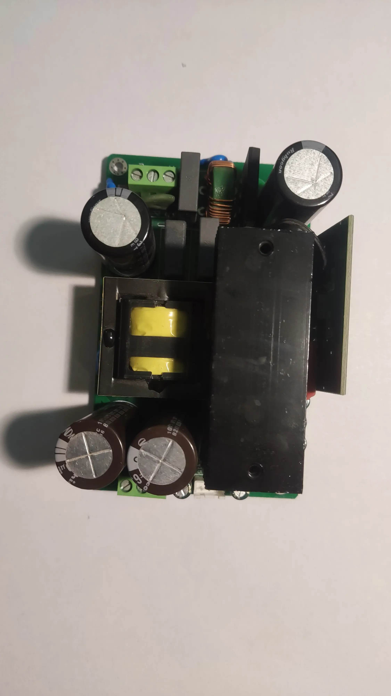
  - 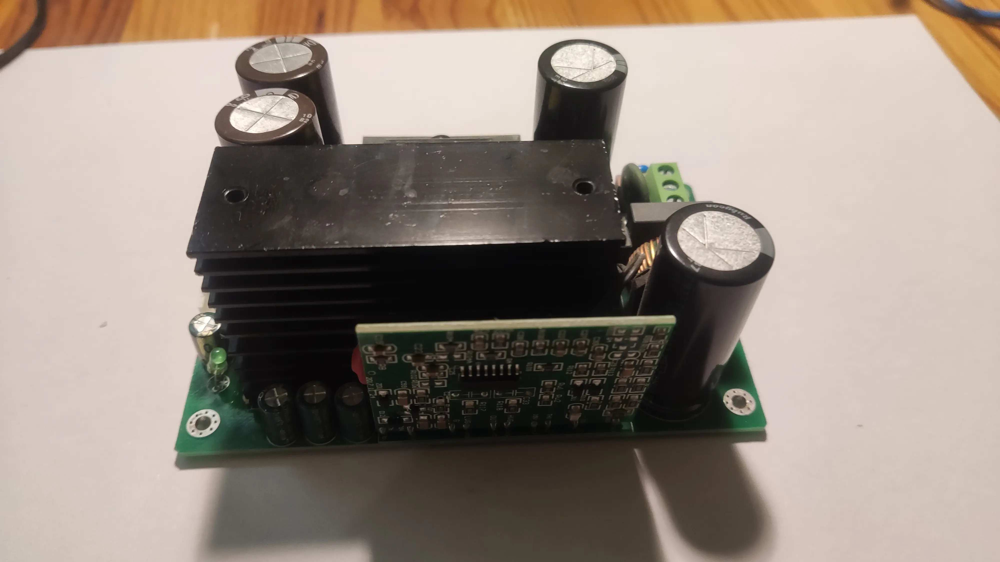
  - 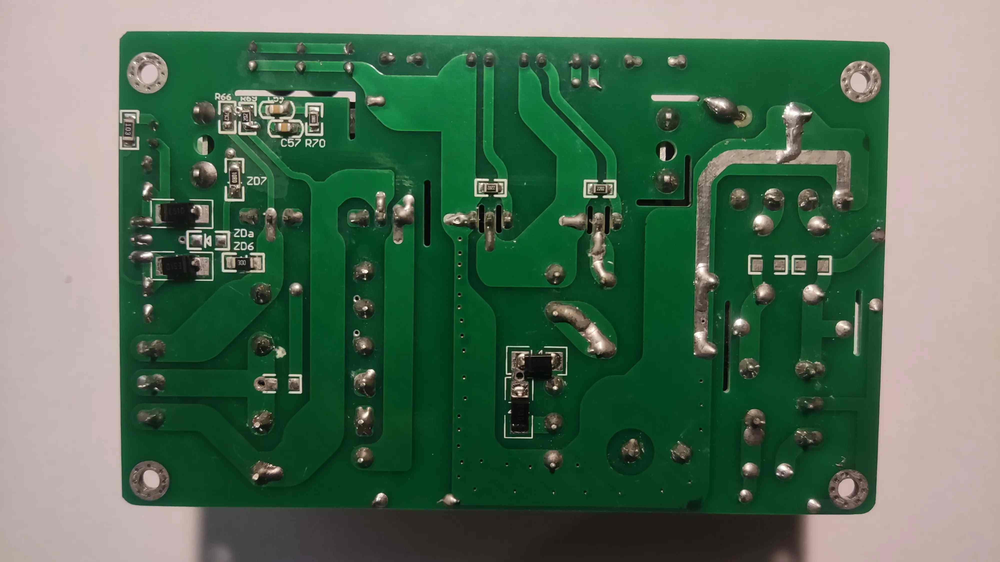

## Amplifier Modules
- **260W Class D Stereo Amplifier Module**
  - 3eaudio model EAUMT-0260-2-B, based on TPA3255 IC (Texas Instruments)
  - THD+N < 0.01% in the range of 0.3W - 200W at 4Ω, 111dBA dynamic range
  - [3eaudio Product Page](https://www.3e-audio.com/amplifier-kits/tpa3255-2ch-260w/)
  - [Product Datasheet](../amplifier/DS_EAUMT-0260-2-A_Rev1.0.pdf)
  - [tpa3255 Datasheet](../amplifier/tpa3255.pdf)
  - DC Voltage supplied - 46V (compromise between Power, THD+N, Heat, speakers resistance)
  - output power rating - 150W (page 11, Figure 8, [tpa3255 Datasheet](../amplifier/tpa3255.pdf)) .
  - 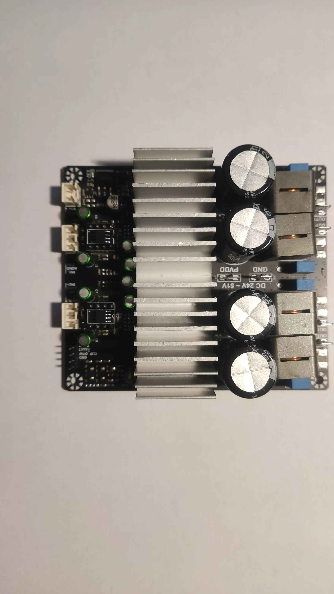
  - 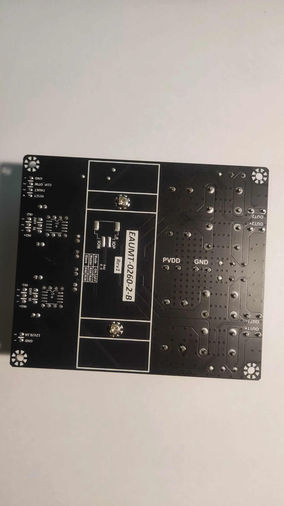

## EMI & Safety
- **EMI Filter Module**
  - No-Name
  - 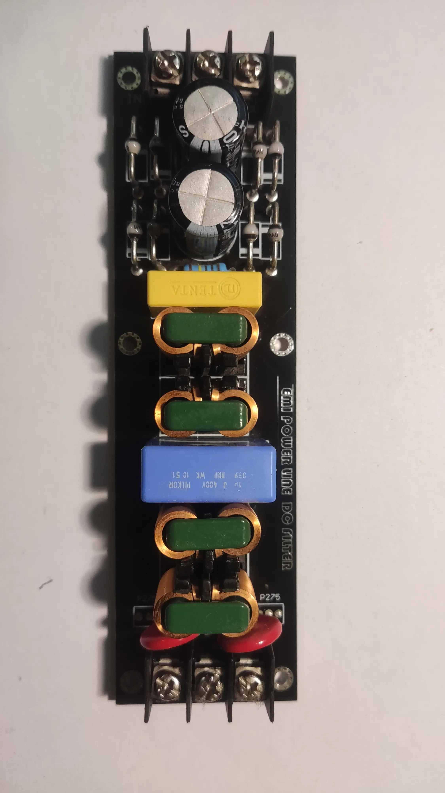
  - 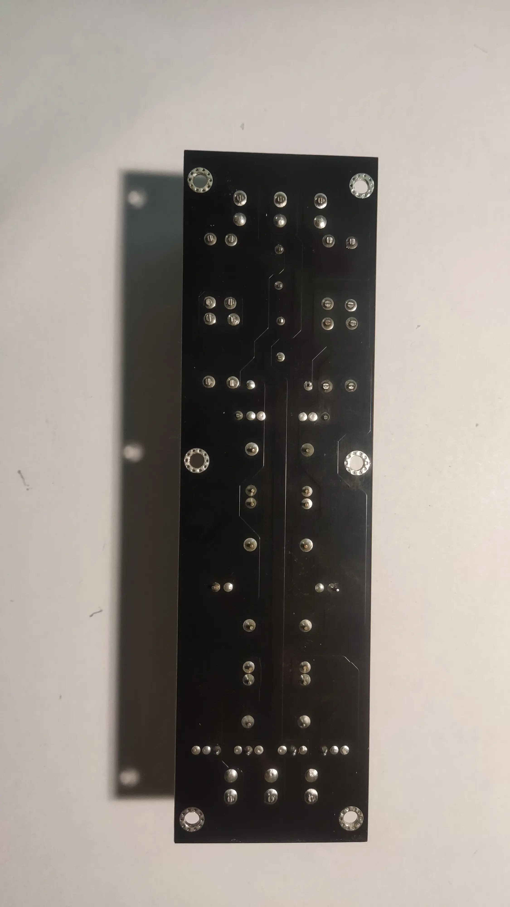
- **Power Relay**
  - No-Name
  - 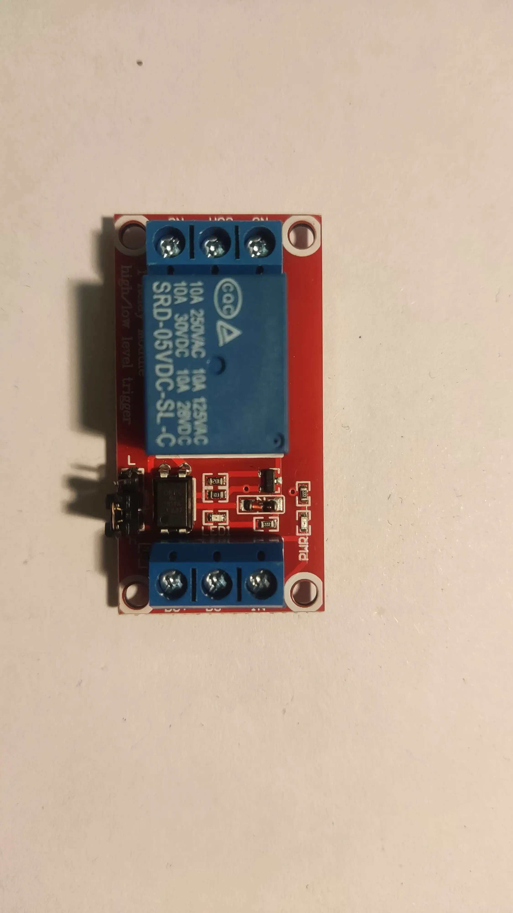
  - 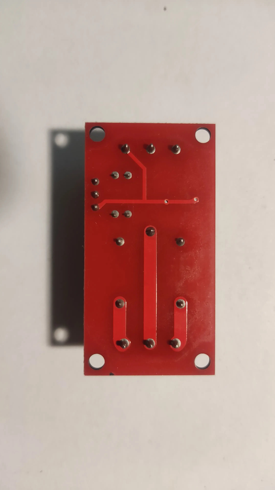

## Enclosure
- **Enclosure**
  - See [Enclosure](../enclosure/readme.md)

