# Assembled and working system in temporary enclosure (receiver, amplifier, speakers)

- [Amplituner User Interface presentation (download .mp4 to view)](https://raw.githubusercontent.com/dabigatran/modular-amplituner/main/assembled_system/ampli_tuner_v1_main.mp4)

- [Amplituner Chromecast Remote Control presentation (download .mp4 to view)](https://raw.githubusercontent.com/dabigatran/modular-amplituner/main/assembled_system/amplituner_v1_remote.mp4)

- 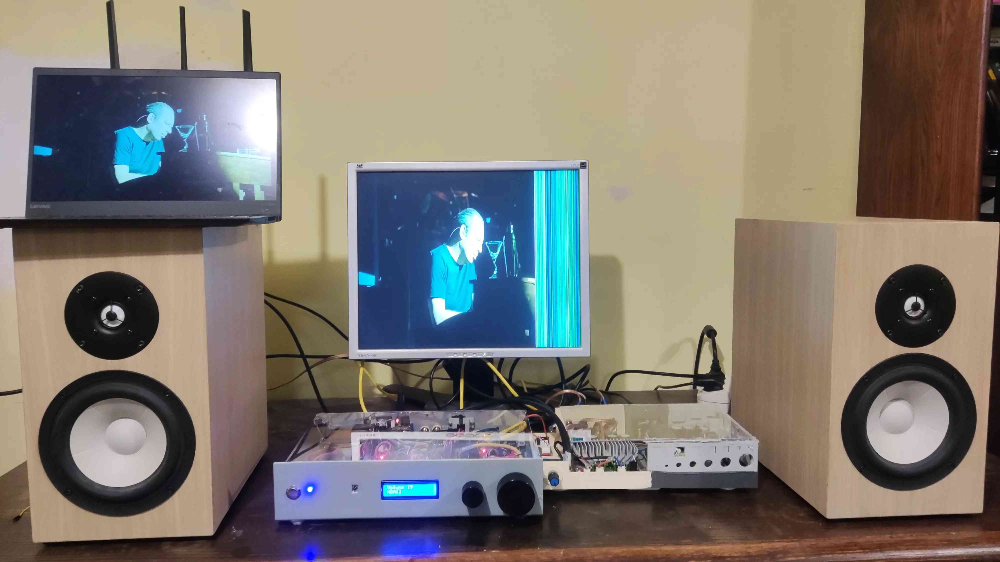
- 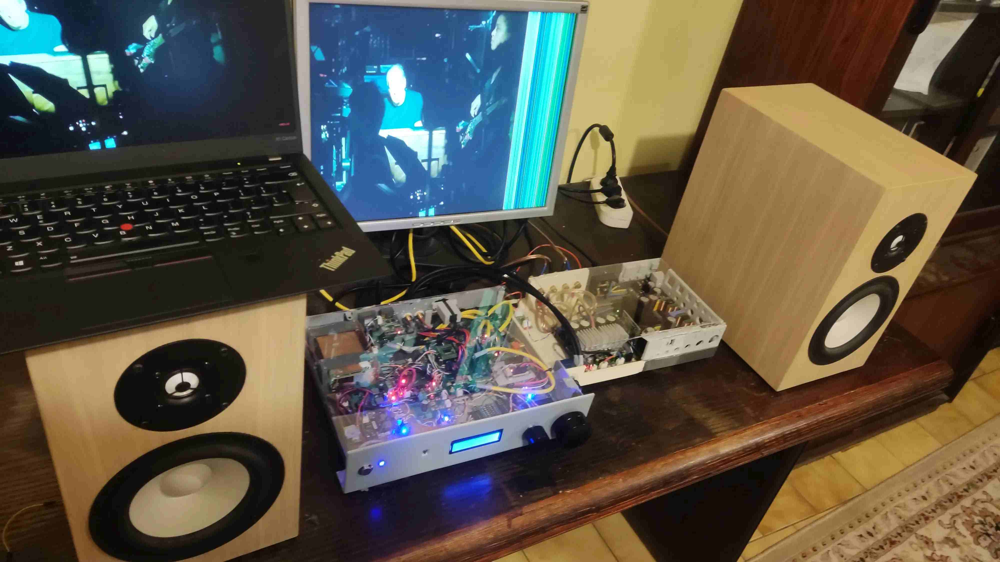
- 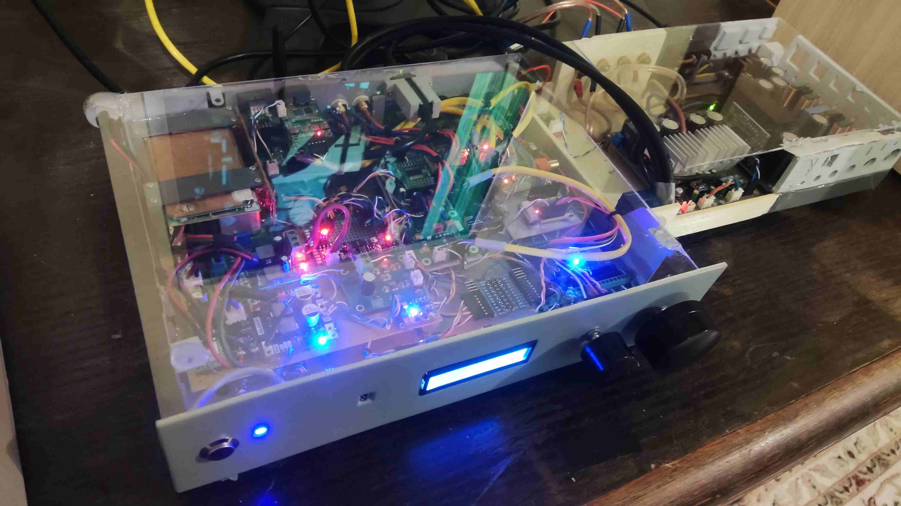
- 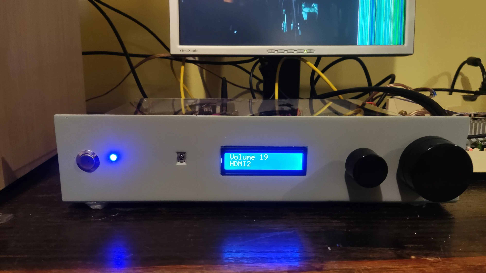
- 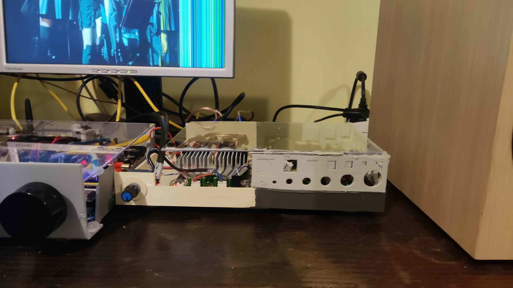
- 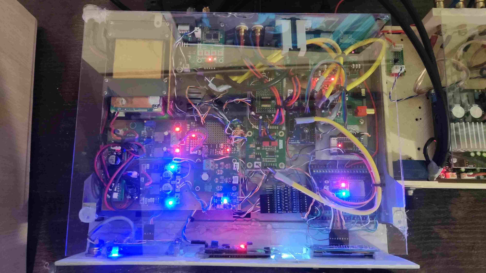
- 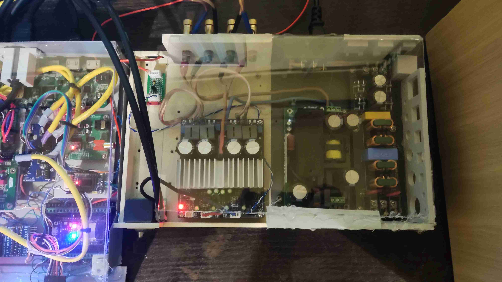
- 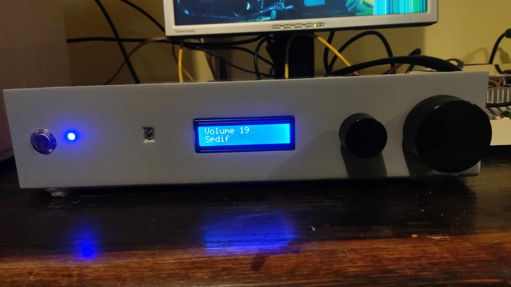
- 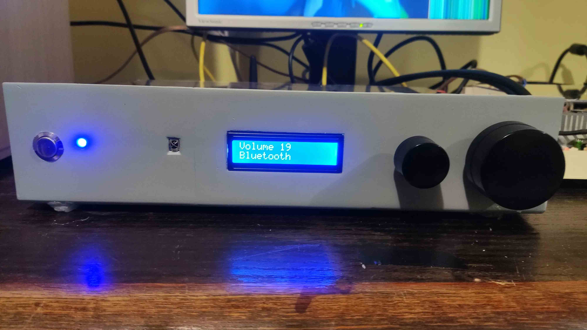
- 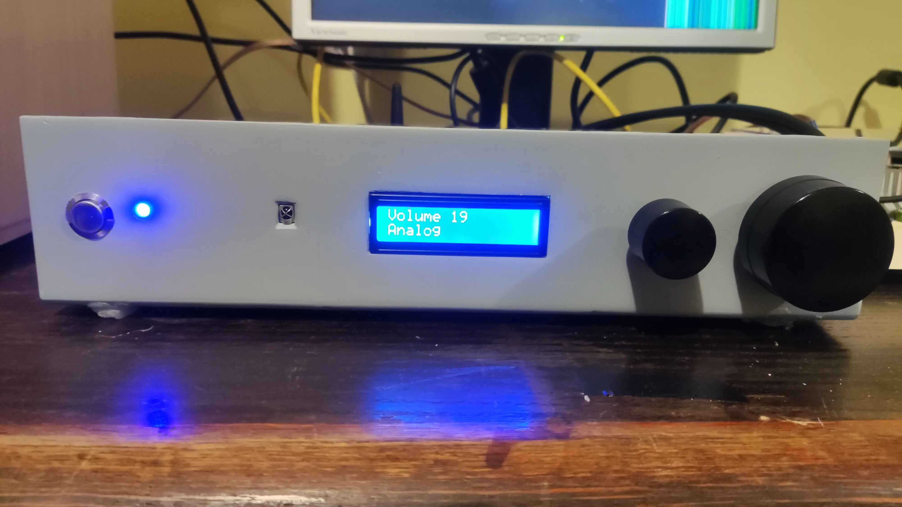
- 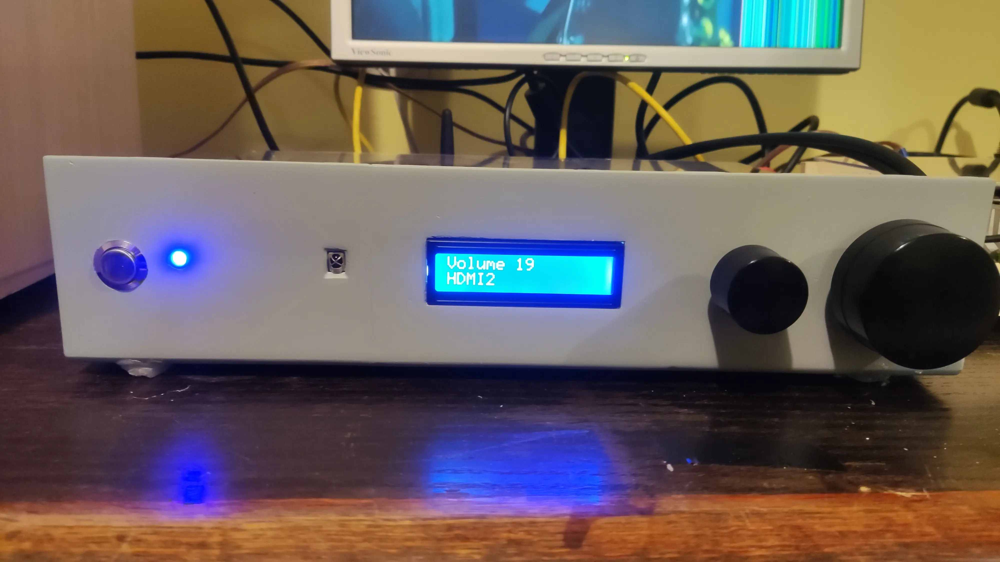
- 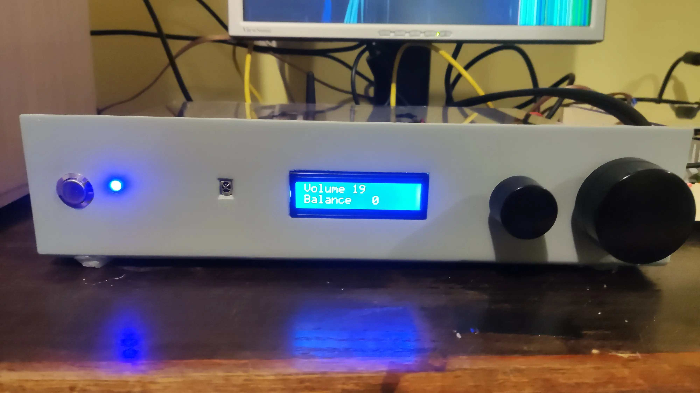
- 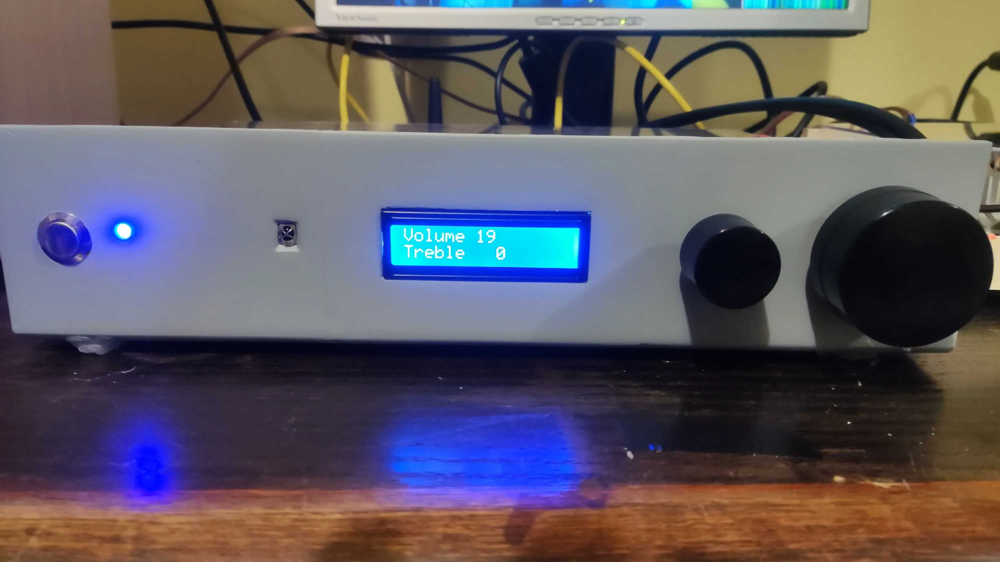
- 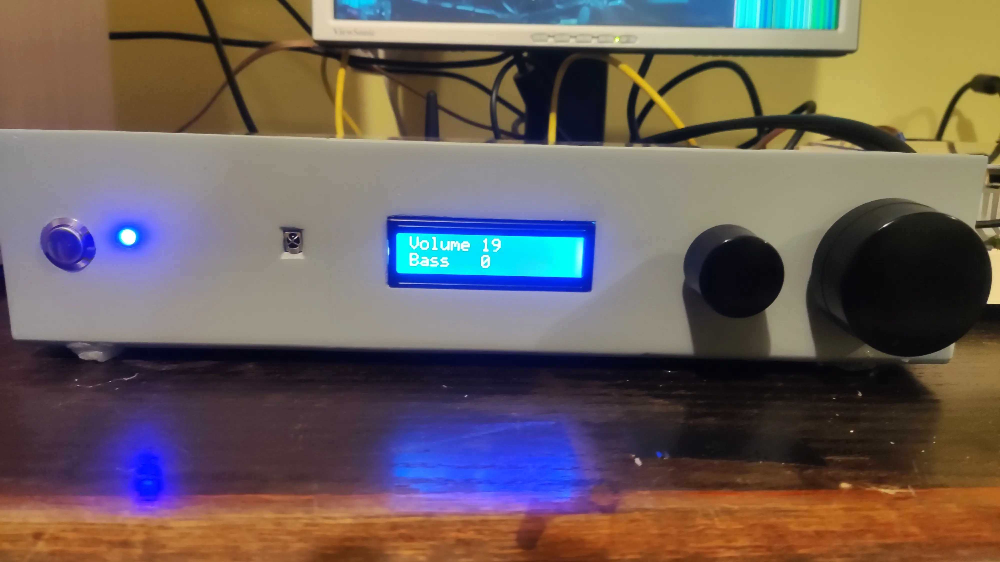
- 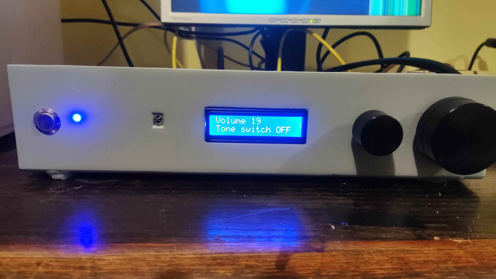
