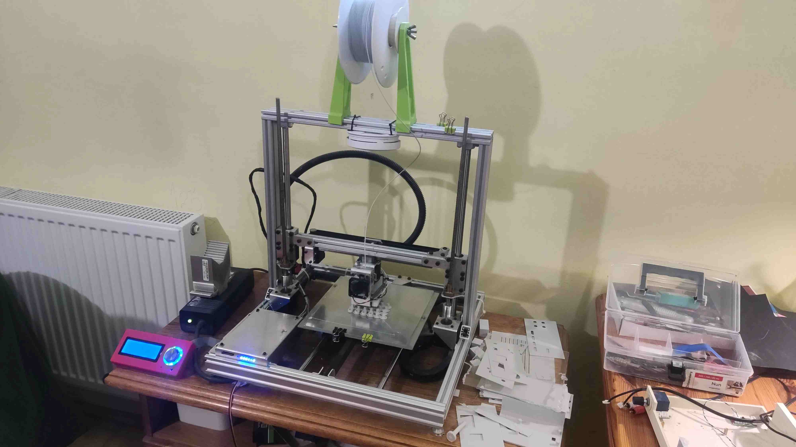
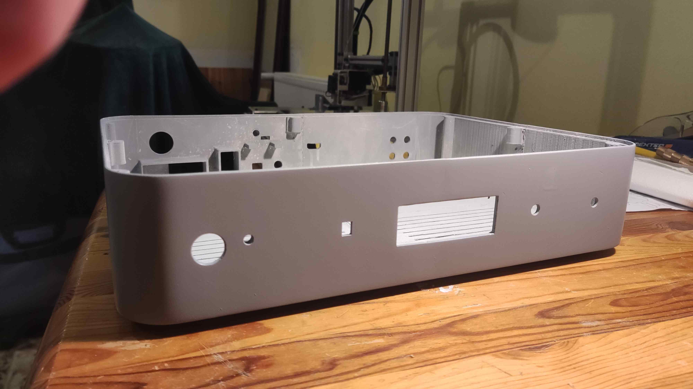
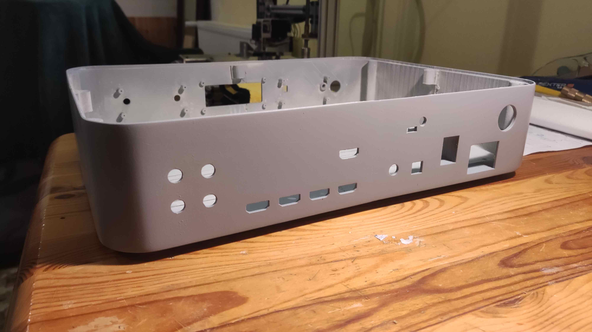
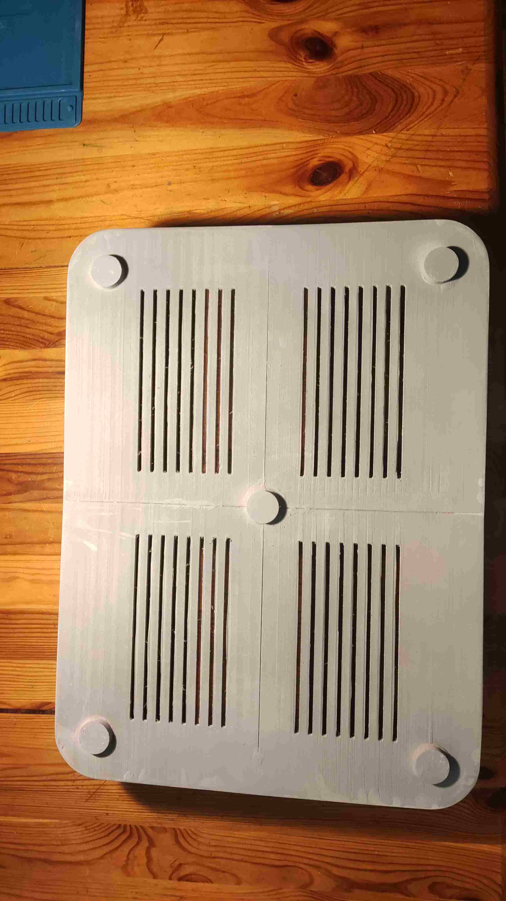
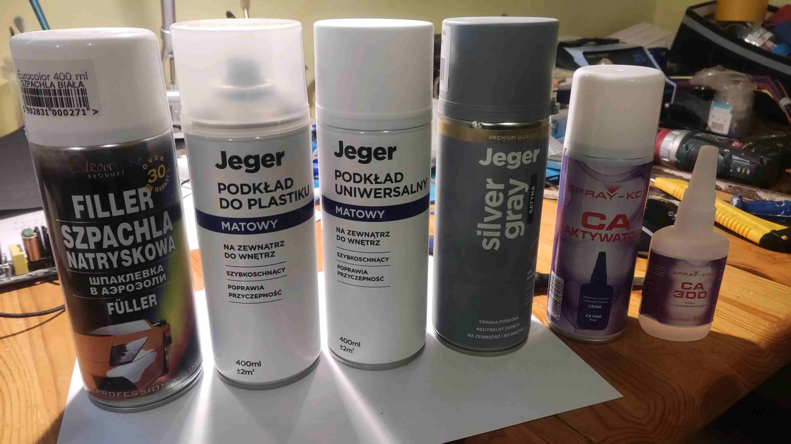

## STLs
- [Amplifier Base](..\enclosure\amplifier_base.stl)
- [Receiver Base](..\enclosure\receiver_base.stl)
- [Receiver and Amplifier Cover](..\enclosure\receiver_and_amplifier_cover.stl)
- [Receiver and Amplifier Cover Support](..\enclosure\receiver_and_amplifier_cover_support.stl)
- [Receiver and Amplifier PCB Support](..\enclosure\receiver_and_amplifier_pcb_support.stl)
- [Receiver and Amplifier Pad](..\enclosure\receiver_and_amplifier_pad.stl)
- [Receiver Power Supply Support](..\enclosure\receiver_power_supply_support.stl)
- [Volume Knob](..\enclosure\volume_knob.stl)
- [Option Knob](..\enclosure\option_knob.stl)

## Printing Details
- **Material**: Impact PLA (Fiberology)
- **Print Temperature**: 225°C
- **Print Bed Temperature**: 50°C for the first layer, 35°C for subsequent layers
- **Adhesive**: Dimafix
- **Print Layer Height**: 0.2 mm
- **Supports**: Yes (use according to your printer's requirements)

## Comments
- **Adhesives**: PCB supports and power supply pads were glued to the case with CA300 and activator.
- **Mounting**: PCBs, covers, and pads were screwed to the case.
- **Print Bed Constraints**: Due to the small print bed of my printer (220x220mm), I had to divide covers and the base of the amplifier and receiver into 4 parts. Printing took 120 hours for all components, and I used approximately 2kg of Impact PLA.
- **Printing Orientation**: Printed with the front face and back face of the receiver/amplifier on the printer's bed to hide print layers.
- **Post-Processing**: To hide layering, I additionally sanded the cases and used primer, car filler, and spray paint.

## Photos

