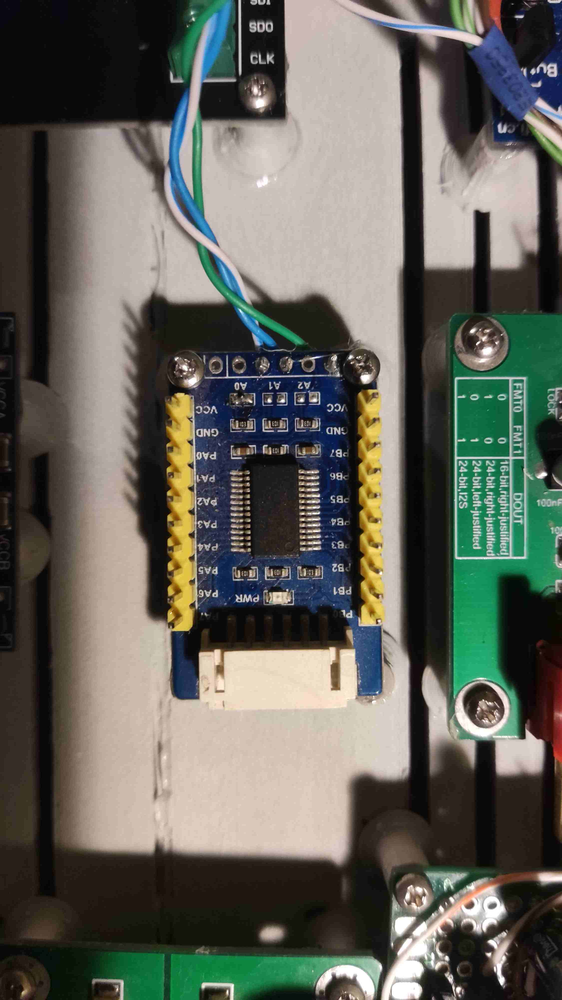

# Receiver Schematics

# Receiver Components

### Power Supply
- **Switching Power Supply (60W, 12V)**
  - No-Name, taken from notebook
  - [Photo](../receiver/No_Name_switching_power_supply.jpg)

### Converters & Stabilizers
- **Step-Down Converter Modules (2x)**
  - No-Name, based on TPS5430 chip (Texas Instruments)
  - [Datasheet](../receiver/tps5430.pdf)
  - 
  - 
- **Low-Noise Linear Stabilizer Module (+5V, 500mA)**
  - No-Name, based on 2x LT3045 chip (Analog Devices)
  - [Datasheet](../receiver/lt3045.pdf)
  - 
- **Low-Noise Linear Stabilizer Module (+5V and -5V, 300mA)**
  - FUTECH, based on LT3045 and LT3094 chips (Analog Devices)
  - [Datasheet](../receiver/LT3094.pdf)
  - [Datasheet](../receiver/lt3045.pdf)
  - 
  - 

### Microcontroller & Extenders
- **Microcontroller Module**
  - SoC ESP32 WROOM DEV KIT (Espressif Systems)
  - [Datasheet](../receiver/ESP-WROOM-32_datasheet.pdf)
  - 
- **I2C Bus Extender Module**
  - MCP23017 (Waveshare 15391)
  - [Datasheet](../receiver/MCP23017.pdf)
  - 

### Displays & Controllers
- **LCD Display Module**
  - LCD1602 (No-Name)
  - [Datasheet](../receiver/LCD1602.pdf)
  - 
  - 
- **LCD Controller Module (via I2C)**
  - Based on PCF8574 (Philips Semiconductors)
  - [Datasheet](../receiver/pcf8574.pdf)

### Audio Components
- **DAC Module**
  - Based on PCM5102 chip (Burr-Brown)
  - [Datasheet](../receiver/pcm5102a.pdf)
  - 
  - 
  - 
- **Analog Audio Control Module**
  - Based on NJW1194 chip (New Japan Radio)
  - [Datasheet](../receiver/NJW1194.PDF)
  - 
  - 
- **Bluetooth 5.0 Stereo Module**
  - Based on QCC5125 chip (Qualcomm)
  - [Datasheet](../receiver/SJR-BTM525_SPEC.pdf)
  - 
  - 
- **Digital Signal Converter (SPDIF to I2S)**
  - Based on DIR9001 chip (Texas Instruments)
  - [Datasheet](../receiver/dir9001.pdf)
  - 
- **I2S Signal Switch Module**
  - Based on HC245 chip (ONSemi)
  - [Datasheet](../receiver/HC245_2304223.pdf)
  - 
  - 

### HDMI & Logic Converters
- **HDMI Source and Output Control Module**
  - No-Name, based on LT8641SXE chip (Lontium Semiconductors)
  - [Datasheet](../receiver/LT8641SXE_Product_Brief.pdf)
  - 
  - 
  - 
  - 
- **5V-3.3V Logic Level Converter Module**
  - No-Name
  - 

### Controls & Interfaces
- **Control Module with Encoders**
  - Two PEC11H series encoders and switch (Bourns)
  - [Datasheet](../receiver/pec11h-1879218.pdf)
  - 
  - 
- **Inverter Module with Schmitt Circuit**
  - Based on 74HC14 integrated circuit (Diodes Incorporated)
  - [Datasheet](../receiver/74HC14.pdf)

### Miscellaneous
- **Other Components**
  - NPN transistors, resistors, capacitors, universal PCBs, wiring, RCA connectors, USB, Bluetooth antennas, heat sink
- **Enclosure**
  - See [enclosure directory](../enclosure) for STL files

